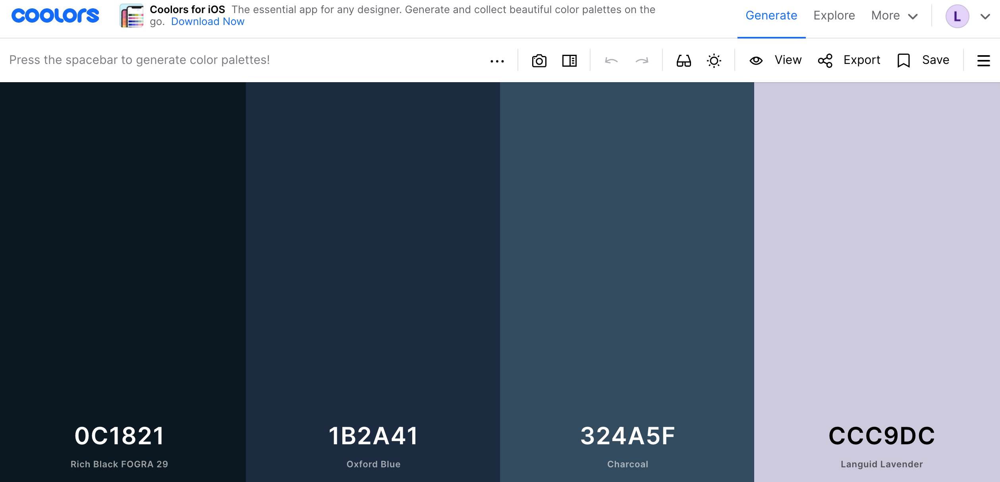
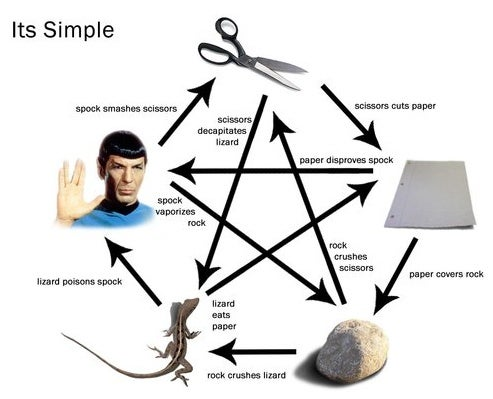
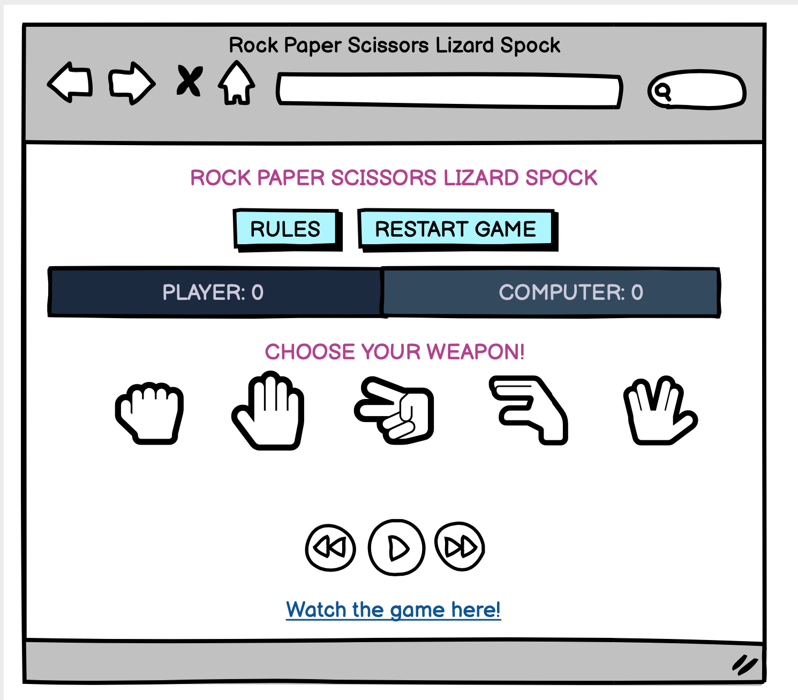
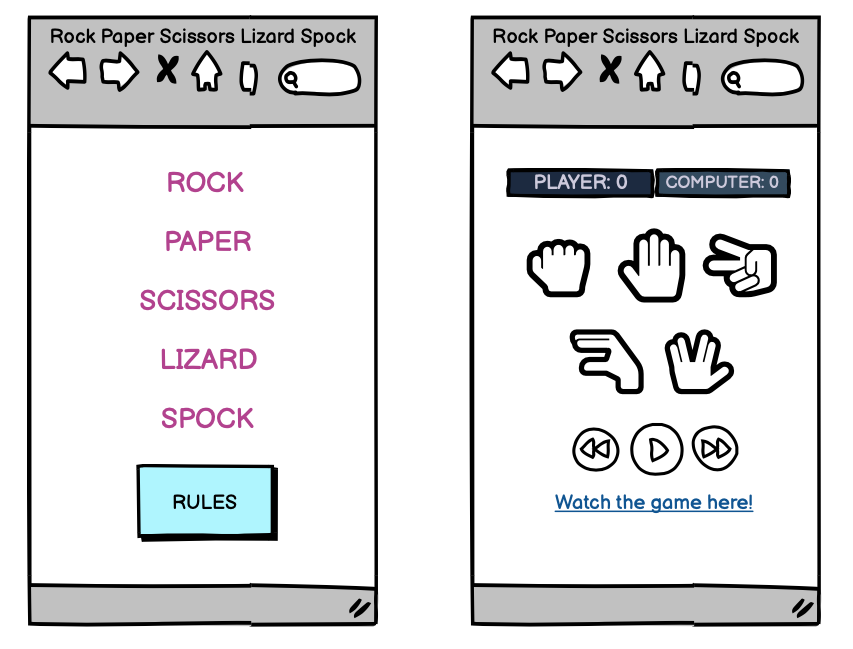
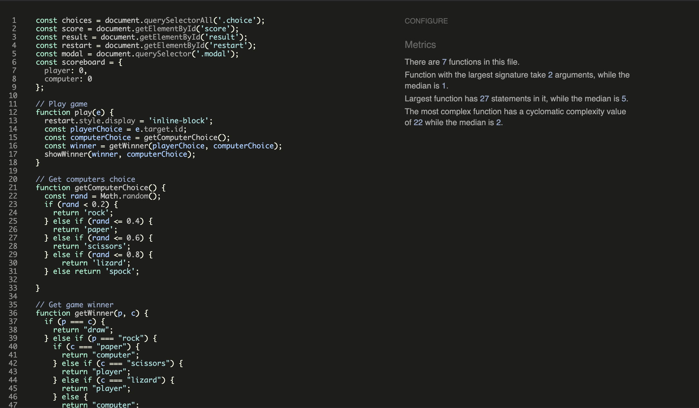

# Introduction

Rock Paper Scissors Lizard Spock is a web based game built in JavaScript, HTML and CSS. It is based on the classic game of Rock Paper Scissors and incorporates the modern Rock Paper Scissor Lizard Spock variant. It is targeted towards users who would like a short fun game to play online.

[View the live project here.](https://lonesg.github.io/portfolio-two/)

<h2 align="center"></h2>

## Table of Contents

<ul>
    <li>
        <a href="#User Experience Design (UX) "><strong>User Experience (UX)</strong></a>               
    </li>
    <li>
        <a href="#The Strategy Plane"><strong>The Strategy Plane</strong></a>
    </li>
    <li>
        <a href="#The Scope Plane"><strong>The Scope Plane</strong></a>   
    </li>
    <li>
        <a href="#The Structure Plane"><strong>The Structure Plane</strong></a>
    </li>
    <li>
        <a href="#The Skeleton Plane"><strong>The Skeleton Plane</strong></a>
    </li>
    <li>
        <a href="#The Surface Plane"><strong>The Surface Plane</strong></a>
    </li>
    <li>
       <a href="#Features"><strong>Features</strong></a> 
    </li>
    <li>
       <a href="#Future Enhancements"><strong>Future Enhancements</strong></a> 
    </li>
    <li>
       <a href="#Testing"><strong>Testing</strong></a> 
    </li>
    <li>
       <a href="#Deployment"><strong>Deployment</strong></a> 
    </li>
    <li>
       <a href="#Credits"><strong>Credits</strong></a> 
    </li>
</ul>
<hr>


## User Experience Design (UX)

-   ### The Strategy Plane
-   #### Site Goals
    Rock, Paper, Scissors, Lizard, Spock is a fun interactive game for people young and old. It is intended for use by all ages, as the game has easy to follow rules and instructions. 

    The game is easy to play, easy to follow and easily navigated by it's players. The main aim of the game is to have fun and try to beat the computer. 

    The target audience covers a huge span of players of all ages. School age children could read and play this game by following the rules listed in the rules section. Equally, it is suitable for an older audience, and in particular, fans of the T.V. show, "The Big Bang Theory". (From which this version of the game originated)

-   #### User Stories

-   ##### First Time Visitor Goals
    
    1. As a First Time Visitor, I want a fun and simple game to play
    2. As a First Time Visitor, I want to know the rules of the game.
    
    <br>

-   ##### Returning Visitor Goals
    1. As a Returning Visitor, I want to find out more about this version of the game.
    2. As a Returning Visitor, I want to interact with the site and use the media player.

    <br>

-   ##### Frequent User Goals
    1. As a Frequent User, 
    2. As a Frequent User, 
        
    <br>
- ### The Scope Plane
- When creating this game I took an agile approach. That is, creating bite-size increments of development at any one time. I worked at the different sections in smaller chunks. I solved smaller parts of the problem by choosing small elements to work on daily. These smaller sprints of work allowed me to ensure the features I wanted to build were done in a timely fashion and also that I didn't succumb to 'scope creep'.
I have met the functional requirements of the game by allowing the user the opportunity to play the game and also to familiarise themselves with the rules for playing. 
I have met the content requirement of the website by providing the players with a game that functions as intended for fun and enjoyment.
I believe this website is entertainig for the users and it offers them a simple chance game to play against the computer. 

<br>

- ### The Structure Plane

- #### Structure
- I decided to break up the game into two different pages. There is the landing page where the user can play the game and there is the rules page which can be acessed through clicking the "Rules" button on the landing page. There is also a modal used on the game site which conveys the winning choice and the computer's choice after every draw to the player.
I chose to use the modal structure as I felt it was a nice simple way to display the computer's score. The player may then click anywhere outside the modal to return to the game interface.

  I wanted to ensure the structure allowed me to implement the functions and features needed to meet the user story requirements.

    *User Story:*
    
    As a user, I want a fun and simple game to play.

    *Acceptance Criteria:*

    It should be clear that it is a game, what it is about and how to play.

    *Implementation:*

    The chosen colour scheme, accesible layout and typography allow the user to interact with a game that is fun, vibrant and easy on the eye. There are links to the rules on the main game site and also links to a Youtube video explaining the rules further.

    *User Story:*
    
    As a user, I want to know the rules of the game.

    *Acceptance Criteria:*

    The user should be able to see the rules clearly to inform their choice when playing.

    *Implementation:*

    The user can access the rules by clicking the "Rules" button to take them to a diagram explaining the rules. They can see all options and how they may win or loose depending on their choice. 
    
    *User Story:*

    As a user, I want to find out more about this version of the game.
    
    *Acceptance Criteria:*

    The user should be able to gain further understanding of this version of the game through instructions or directions.

    *Implementation:*

    The user will be able to read the rules of the game using the "Rules" page. Users may want more information and    can find this by clicking on the Youtube link to take them to a further oral explanation from the T.V. show "The Big Bang Theory"

    *User Story:*

    As a user, I want to interact with the site and use the media player.

    *Acceptance Criteria:*

    The user should be able to play background music by using the audio controls underneath the game area.

    *Implementation:*

    The user will have the option to play a music clip which incorporates the voice of Spock from T.V. show, Star Trek. This is a nice nod to the "Spock" element of the game - with the audio playing an excerpt from the character Spock. This sets the tone and should provide the player with some light hearted entertainment.


-   ### The Skeleton Plane

    -   #### Colour Scheme
        -   The main colours used were chosen from a complimetary color pallete generator online. I wanted the colours to be complimetary but understated and to not draw away from the game. I then chose a plum shade, (#B43E8F) to use as my main text colour, the hover over icon colour and also as my text colour on my buttons. I chose this colour by playing around with the hue of the last colour from my pallete, #CCC9DC. In doing so, I could be sure the colour would offer a contrast to the darker colours, without being harsh or hard to see. 

            

    -   #### Typography
        -   The "Luckiest Guy "font is the main font used throughout the whole website with Sans Serif as the fallback font in case for any reason the font isn't being imported into the site correctly. Luckiest Guy is a fun and playful font and it struck me as the perfect choice for a simple, fun game. I liked this font and think it brings an element of fun to the look of the site. 

    -   #### Imagery
        -   I chose a simple image of the rules to convey the message to the player. This image was taken from the website [Instructables](https://www.instructables.com/How-to-Play-Rock-Paper-Scissors-Lizard-Spock/#discuss) This website allows for screenshot usage of their information. *Autodesk screen shots reprinted courtesy of Autodesk, Inc.*
        

    -   #### Wireframes

    -   Desktop Wireframes- 
    

    -   Mobile Wireframe - 


## Features

-   Responsive on all device sizes


## Technologies

### Languages Used

-   [HTML5](https://en.wikipedia.org/wiki/HTML5)
-   [CSS3](https://en.wikipedia.org/wiki/Cascading_Style_Sheets)
-   [JavaScript](https://en.wikipedia.org/wiki/JavaScript)

### Frameworks, Libraries & Programs Used

1. [Google Fonts:](https://fonts.google.com/)
    - Google fonts were used to import the 'Titillium Web' font into the style.css file which is used on all pages throughout the project.
1. [Font Awesome:](https://fontawesome.com/)
    - Font Awesome was used for the game icons.
1. [Git](https://git-scm.com/)
    - Git was used for version control by utilizing the Gitpod terminal to commit to Git and Push to GitHub.
1. [GitHub:](https://github.com/)
    - GitHub is used to store the projects code after being pushed from Git.
1. [Balsamiq:](https://balsamiq.com/)
    - Balsamiq was used to create the wireframes during the design process.

## Testing

The W3C Markup Validator, W3C CSS Validator Services and JSHint JavaScript Validator were used to validate the project to ensure there were no syntax errors in the project.

-  
-   
-  

### Testing User Stories from User Experience (UX) Section

-   #### First Time Visitor Goals

    1. As a First Time Visitor, I want to easily understand the main purpose of the site and learn more about the organisation.

        1. Upon entering the site, users are automatically greeted with a clean and easily readable navigation bar to go to the page of their choice. Underneath there is a Hero Image with Text and a "Learn More" Call to action button.
        2. The main points are made immediately with the hero image
        3. The user has two options, click the call to action buttons or scroll down, both of which will lead to the same place, to learn more about the organisation.

    2. As a First Time Visitor, I want to be able to easily be able to navigate throughout the site to find content.

        1. The site has been designed to be fluid and never to entrap the user. At the top of each page there is a clean navigation bar, each link describes what the page they will end up at clearly.
        2. At the bottom of the first 3 pages there is a redirection call to action to ensure the user always has somewhere to go and doesn't feel trapped as they get to the bottom of the page.
        3. On the Contact Us Page, after a form response is submitted, the page refreshes and the user is brought to the top of the page where the navigation bar is.

    3. As a First Time Visitor, I want to look for testimonials to understand what their users think of them and see if they are trusted. I also want to locate their social media links to see their following on social media to determine how trusted and known they are.
        1. Once the new visitor has read the About Us and What We Do text, they will notice the Why We are Loved So Much section.
        2. The user can also scroll to the bottom of any page on the site to locate social media links in the footer.
        3. At the bottom of the Contact Us page, the user is told underneath the form, that alternatively they can contact the organisation on social media which highlights the links to them.

-   #### Returning Visitor Goals

    1. As a Returning Visitor, I want to find the new programming challenges or hackathons.

        1. These are clearly shown in the banner message.
        2. They will be directed to a page with another hero image and call to action.

    2. As a Returning Visitor, I want to find the best way to get in contact with the organisation with any questions I may have.

        1. The navigation bar clearly highlights the "Contact Us" Page.
        2. Here they can fill out the form on the page or are told that alternatively they can message the organisation on social media.
        3. The footer contains links to the organisations Facebook, Twitter and Instagram page as well as the organization's email.
        4. Whichever link they click, it will be open up in a new tab to ensure the user can easily get back to the website.
        5. The email button is set up to automatically open up your email app and autofill there email address in the "To" section.

    3. As a Returning Visitor, I want to find the Facebook Group link so that I can join and interact with others in the community.
        1. The Facebook Page can be found at the footer of every page and will open a new tab for the user and more information can be found on the Facebook page.
        2. Alternatively, the user can scroll to the bottom of the Home page to find the Facebook Group redirect card and can easily join by clicking the "Join Now!" button which like any external link, will open in a new tab to ensure they can get back to the website easily.
        3. If the user is on the "Our Favourites" page they will also be greeted with a call to action button to invite the user to the Facebook group. The user is incentivized as they are told there is a weekly favourite product posted in the group.

-   #### Frequent User Goals

    1. As a Frequent User, I want to check to see if there are any newly added challenges or hackathons.

        1. The user would already be comfortable with the website layout and can easily click the banner message.

    2. As a Frequent User, I want to check to see if there are any new blog posts.

        1. The user would already be comfortable with the website layout and can easily click the blog link

    3. As a Frequent User, I want to sign up to the Newsletter so that I am emailed any major updates and/or changes to the website or organisation.
        1. At the bottom of every page their is a footer which content is consistent throughout all pages.
        2. To the right hand side of the footer the user can see "Subscribe to our Newsletter" and are prompted to Enter their email address.
        3. There is a "Submit" button to the right hand side of the input field which is located close to the field and can easily be distinguished.

### Further Testing

-   The Website was tested on Google Chrome, Internet Explorer, Microsoft Edge and Safari browsers.
-   The website was viewed on a variety of devices such as Desktop, Laptop, iPhone7, iPhone 8 & iPhoneX.
-   A large amount of testing was done to ensure that all pages were linking correctly.
-   Friends and family members were asked to review the site and documentation to point out any bugs and/or user experience issues.

### Known Bugs

-   On some mobile devices the Hero Image pushes the size of screen out more than any of the other content on the page.
    -   A white gap can be seen to the right of the footer and navigation bar as a result.
-   On Microsoft Edge and Internet Explorer Browsers, all links in Navbar are pushed upwards when hovering over them.

## Deployment

### GitHub Pages

The project was deployed to GitHub Pages using the following steps...

1. Log in to GitHub and locate the [GitHub Repository](https://github.com/)
2. At the top of the Repository (not top of page), locate the "Settings" Button on the menu.
    - Alternatively Click [Here](https://raw.githubusercontent.com/) for a GIF demonstrating the process starting from Step 2.
3. Scroll down the Settings page until you locate the "GitHub Pages" Section.
4. Under "Source", click the dropdown called "None" and select "Master Branch".
5. The page will automatically refresh.
6. Scroll back down through the page to locate the now published site [link](https://github.com) in the "GitHub Pages" section.

### Forking the GitHub Repository

By forking the GitHub Repository we make a copy of the original repository on our GitHub account to view and/or make changes without affecting the original repository by using the following steps...

1. Log in to GitHub and locate the [GitHub Repository](https://github.com/)
2. At the top of the Repository (not top of page) just above the "Settings" Button on the menu, locate the "Fork" Button.
3. You should now have a copy of the original repository in your GitHub account.

### Making a Local Clone

1. Log in to GitHub and locate the [GitHub Repository](https://github.com/)
2. Under the repository name, click "Clone or download".
3. To clone the repository using HTTPS, under "Clone with HTTPS", copy the link.
4. Open Git Bash
5. Change the current working directory to the location where you want the cloned directory to be made.
6. Type `git clone`, and then paste the URL you copied in Step 3.

```
$ git clone https://github.com/YOUR-USERNAME/YOUR-REPOSITORY
```

7. Press Enter. Your local clone will be created.

```
$ git clone https://github.com/YOUR-USERNAME/YOUR-REPOSITORY
> Cloning into `CI-Clone`...
> remote: Counting objects: 10, done.
> remote: Compressing objects: 100% (8/8), done.
> remove: Total 10 (delta 1), reused 10 (delta 1)
> Unpacking objects: 100% (10/10), done.
```

Click [Here](https://help.github.com/en/github/creating-cloning-and-archiving-repositories/cloning-a-repository#cloning-a-repository-to-github-desktop) to retrieve pictures for some of the buttons and more detailed explanations of the above process.

## Credits

### Code

-   The full-screen hero image code came from this [StackOverflow post](https://stackoverflow.com)

-   [Bootstrap4](https://getbootstrap.com/docs/4.4/getting-started/introduction/): Bootstrap Library used throughout the project mainly to make site responsive using the Bootstrap Grid System.

-   [MDN Web Docs](https://developer.mozilla.org/) : For Pattern Validation code. Code was modified to better fit my needs and to match an Irish phone number layout to ensure correct validation. Tutorial Found [Here](https://developer.mozilla.org/en-US/docs/Web/HTML/Element/input/tel#Pattern_validation)

### Content

-   All content was written by the developer.

-   Psychological properties of colours text in the README.md was found [here](http://www.colour-affects.co.uk/psychological-properties-of-colours)

### Media

-   All Images were created by the developer.

### Acknowledgements

-   My Mentor for continuous helpful feedback.

-   Tutor support at Code Institute for their support.