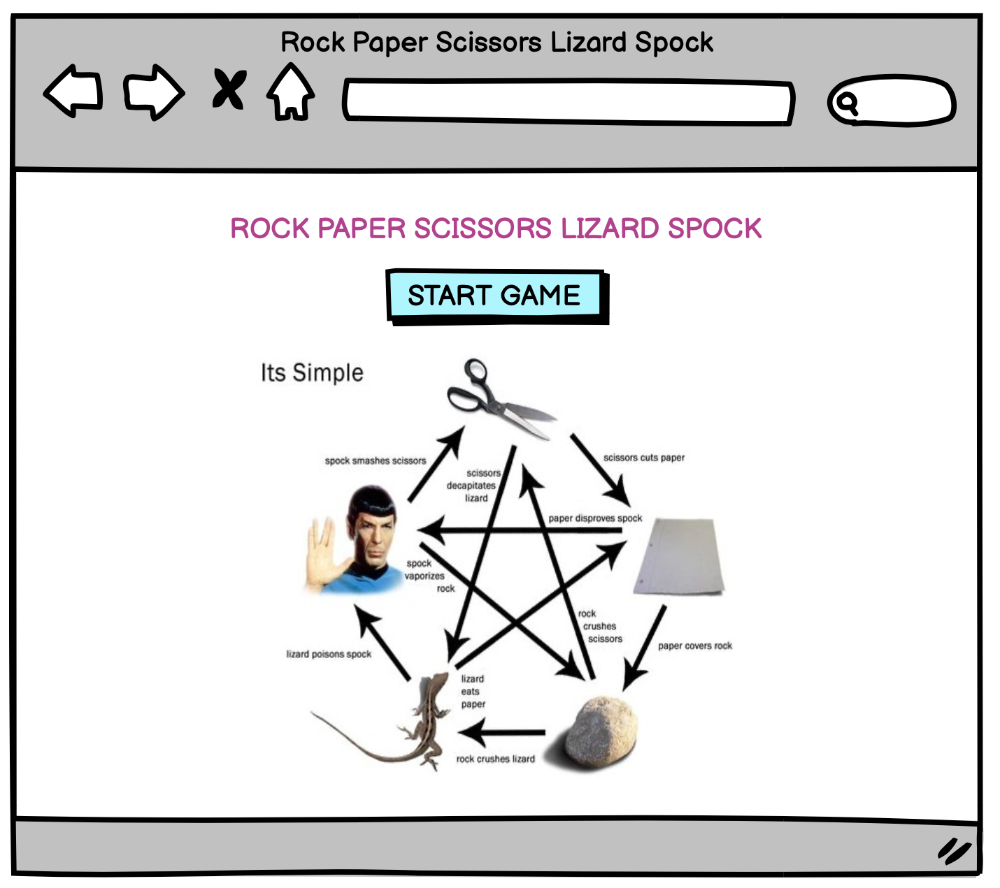
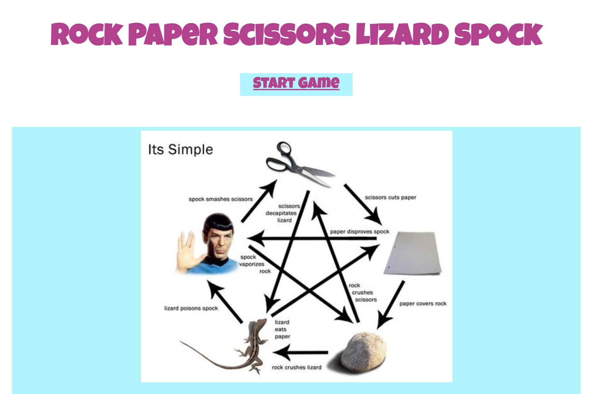
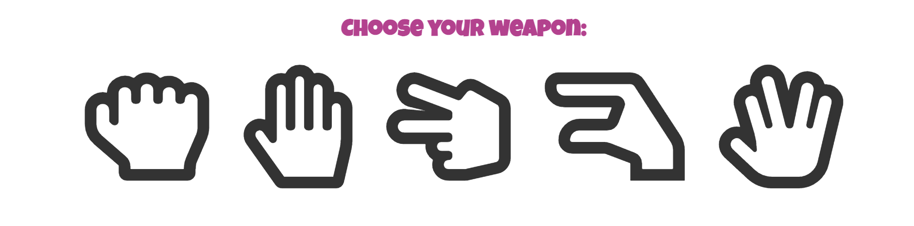
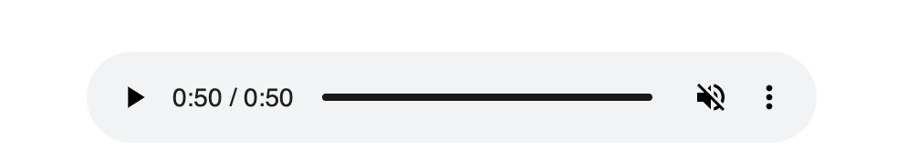
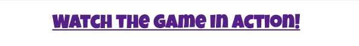
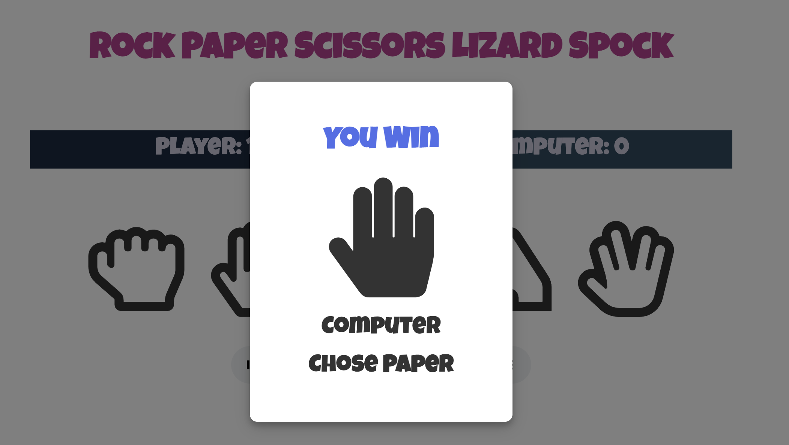
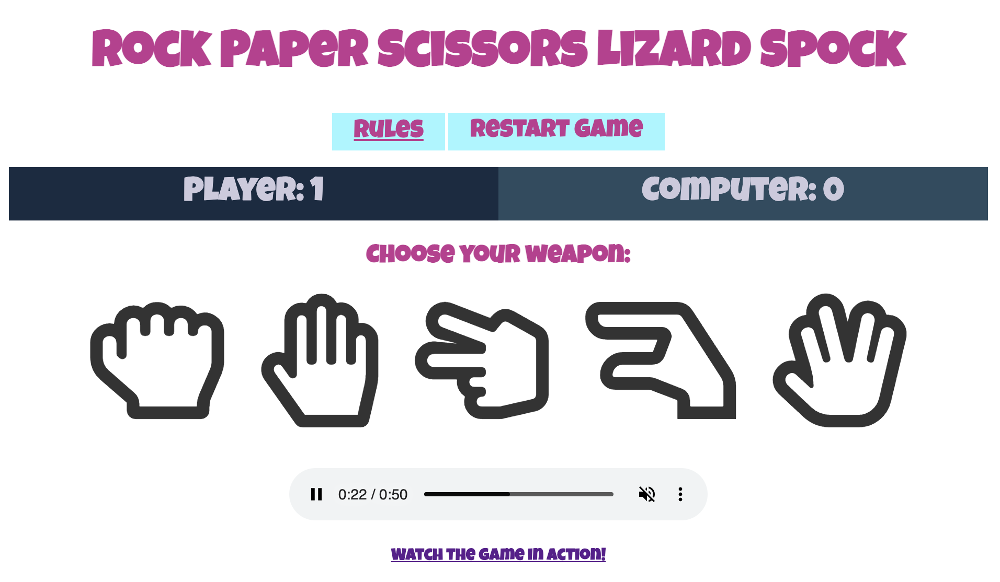

# Introduction

Rock Paper Scissors Lizard Spock is a web based game built in JavaScript, HTML and CSS. It is based on the classic game of Rock Paper Scissors and incorporates the modern Rock Paper Scissor Lizard Spock variant. It is targeted towards users who would like a short fun game based on chance to play online.

[View the live project here.](https://lonesg.github.io/portfolio-two/)


## Table of Contents
<ol>
 <li>User Experience (UX)</li>
 <ol>
 <li>The Strategy Plane</li>
 <li>The Scope Plane</li>
 <li>The Structure Plane</li>
 <li>The Skeleton Plane</li>
 <li>The Surface Plane</li>
 </ol>
 <li>Features</li>
 <li>Future Features</li>
 <li>Testing</li>
 <li>Deployment</li>
 <li>Credits</li>
</ol>
 <hr>

## User Experience (UX)

-   ### The Strategy Plane
-   #### Site Goals
    Rock, Paper, Scissors, Lizard, Spock is a fun interactive game for people young and old. It is intended for use by all ages, as the game has easy to follow rules and instructions. 

    The game is easy to play, easy to follow and easily navigated by it's players. The main aim of the game is to have fun and try to beat the computer. 

    The target audience covers a huge span of players of all ages. School age children could read and play this game by following the rules listed in the rules section. Equally, it is suitable for an older audience, and in particular, fans of the T.V. show, "The Big Bang Theory". (From which this version of the game originated)

-   #### User Stories

-   ##### First Time Visitor Goals
    
    1. As a First Time Visitor, I want a fun and simple game to play
    2. As a First Time Visitor, I want to know the rules of the game.
    
    <br>

-   ##### Returning Visitor Goals
    1. As a Returning Visitor, I want to find out more about this version of the game.
    2. As a Returning Visitor, I want to interact with the site and use the media player.

    <br>
- ### The Scope Plane
- When creating this game I took an agile approach. That is, creating bite-size increments of development at any one time. I worked at the different sections in smaller chunks. I solved smaller parts of the problem by choosing small elements to work on daily. These smaller sprints of work allowed me to ensure the features I wanted to build were done in a timely fashion and also that I didn't succumb to 'scope creep'.
I have met the functional requirements of the game by allowing the user the opportunity to play the game and also to familiarise themselves with the rules for playing. 
I have met the content requirement of the website by providing the players with a game that functions as intended for fun and enjoyment.
I believe this website is entertaining for the users and it offers them a simple chance game to play against the computer. 

<br>

- ### The Structure Plane

- #### Structure
- I decided to break up the game into two different pages. There is the landing page where the user can play the game and there is the rules page which can be acessed through clicking the "Rules" button on the landing page. There is also a modal used on the game site which conveys the winning choice and the computer's choice after every draw to the player.
I chose to use the modal structure as I felt it was a nice simple way to display the computer's score. The player may then click anywhere outside the modal to return to the game interface.

  I wanted to ensure the structure allowed me to implement the functions and features needed to meet the user story requirements.

    *User Story:*
    
    As a user, I want a fun and simple game to play.

    *Acceptance Criteria:*

    It should be clear that it is a game, what it is about and how to play.

    *Implementation:*

    The chosen colour scheme, accesible layout and typography allow the user to interact with a game that is fun, vibrant and easy on the eye. There are links to the rules on the main game site and also links to a Youtube video explaining the rules further.

    *User Story:*
    
    As a user, I want to know the rules of the game.

    *Acceptance Criteria:*

    The user should be able to see the rules clearly to inform their choice when playing.

    *Implementation:*

    The user can access the rules by clicking the "Rules" button to take them to a diagram explaining the rules. They can see all options and how they may win or loose depending on their choice. 
    
    *User Story:*

    As a user, I want to find out more about this version of the game.
    
    *Acceptance Criteria:*

    The user should be able to gain further understanding of this version of the game through instructions or directions.

    *Implementation:*

    The user will be able to read the rules of the game using the "Rules" page. Users may want more information and    can find this by clicking on the Youtube link to take them to a further oral explanation from the T.V. show "The Big Bang Theory"

    *User Story:*

    As a user, I want to interact with the site and use the media player.

    *Acceptance Criteria:*

    The user should be able to play background music by using the audio controls underneath the game area.

    *Implementation:*

    The user will have the option to play a music clip which incorporates the voice of Spock from T.V. show, Star Trek. This is a nice nod to the "Spock" element of the game - with the audio playing an excerpt from the character Spock. This sets the tone and should provide the player with some light hearted entertainment.


-   ### The Skeleton Plane

    -   #### Wireframes
    - I used Balsamiq to make initial Wireframes in the design part of the process.

    -   Desktop Wireframes- 
    

    -   Mobile Wireframe - 

-   ### The Surface Plane

    -   #### Colour Scheme
        -   The main colours used were chosen from a complimetary color pallete generator online. I wanted the colours to be complimetary but understated and to not draw away from the game. I then chose a plum shade, (#B43E8F) to use as my main text colour, the hover over icon colour and also as my text colour on my buttons. I chose this colour by playing around with the hue of the last colour from my pallete, #CCC9DC. In doing so, I could be sure the colour would offer a contrast to the darker colours, without being harsh or hard to see. 

            

    -   #### Typography
        -   The "Luckiest Guy "font is the main font used throughout the whole website with Sans Serif as the fallback font in case for any reason the font isn't being imported into the site correctly. Luckiest Guy is a fun and playful font and it struck me as the perfect choice for a simple, fun game. I liked this font and think it brings an element of fun to the look of the site. 

    -   #### Imagery
        -   I chose a simple image of the rules to convey the message to the player. This image was taken from the website [Instructables](https://www.instructables.com/How-to-Play-Rock-Paper-Scissors-Lizard-Spock/#discuss) This website allows for screenshot usage of their information. *Autodesk screen shots reprinted courtesy of Autodesk, Inc.*
        


## Features

-   Responsive on all device sizes.

### Landing Page
- The user opens the game and lands on the following page which is bright and colourful using contrasting colours that are easy on the eye for the user.

### Header
- The first piece of text the player sees is the game title, "Rock Paper Scissors Lizard Spock", which identifies what the page is about and the name of the game being played.

### Rules
- The user then encounters the "Rules" link which takes them to the rules page, where they can learn how to play if unsure of the rules. The text again, is Google font "Luckiest Guy" which is the same as the header, in keeping with the overal style. Throughout the game, these links are styled in the same uniform way so that players can navigate the site and the game easily.

#### Rules Page
- The rules page uses an image to display the rules of the game, Rock Paper Scissors Lizard. The user may use this page to clarify the rules and to identify the winning hand in each round.

### Start Game
- Once the user is on the rules page, they can also return to the game page from here by using the "Start Game" link. Again, the link is styled in line with the site's colours so that the user can navigate the game easily.

### Scoreboard
- The player then sees the scoreboard area, where they can keep count of their own score as well as the computer's score. The initial number shown is "0" for both players, however this increments after each round.

### Game Area
- The player then encounters the game area, where they choose their weapon of choice, either rock, paper, scissors, lizard or spock. Each option is styled using a Fontawesome icon of the same size and colour. When the user hovers over the icon, the icon is highlighted in pink. This colour is the same colour as the header text in line with the overall styling of the game.

#### Audio Player
- The player may add some sound to their gaming experience by choosing to turn on the audio player. This audio is set to mute on page loading. The user has control of the audio with the play button and the volume control. The audio is a clip of Spock from Star Trek, a nod to the Spock element of this variant of the game.

#### Footer
- The footer gives the player the option to follow a link to a Youtube clip, which again gives more details of the game and the rules. This link opens in a new window, allowing the user to stay on the game page.

#### Modal
- The modal displays the winning player of each round to the player. The message "You win" is displayed in the same pink colour used throught the site. The message "You lose" is displayed in blue, which is a lighter hue from the site colour pallete. The text "It's a draw" is displayed in the same grey colour as is used on the modal. In this way, the user gets to know the colours as siganls for a winning round, losing round or a draw.
- The modal also displays the computer's choice also to the player.

#### Restart Game
- The restart game link allows the player to restart the game, which sets the scoreboard back to "0" for each player. This button is hidden on the landing page initially. It only loads once the player has made their first choice. A player may reset the game after one round.


## Future Features 

- I would like to develop this game further by adding a level of difficulty. I would like to make a regular Rock, Paper, Scissors game and then add an option for the player to play the original version or else play the "Lizard, Spock" variation of the game as I have created.


## Technologies

### Languages Used

-   [HTML5](https://en.wikipedia.org/wiki/HTML5)
-   [CSS3](https://en.wikipedia.org/wiki/Cascading_Style_Sheets)
-   [JavaScript](https://en.wikipedia.org/wiki/JavaScript)

### Frameworks, Libraries & Programs Used

1. [Google Fonts:](https://fonts.google.com/)
    - Google fonts were used to import the 'Luckiest Guy' font into the style.css file which is used on all pages throughout the project.
1. [Font Awesome:](https://fontawesome.com/)
    - Font Awesome was used for the game icons.
1. [Git](https://git-scm.com/)
    - Git was used for version control by utilizing the Gitpod terminal to commit to Git and Push to GitHub.
1. [GitHub:](https://github.com/)
    - GitHub is used to store the projects code after being pushed from Git.
1. [Balsamiq:](https://balsamiq.com/)
    - Balsamiq was used to create the wireframes during the design process.
1. [Bootstrap:](https://getbootstrap.com/docs/4.0/getting-started/introduction/)
    - Bootstrap Introduction was used to find a script to fix the modal on mobile devices.

## Testing

The W3C Markup Validator, W3C CSS Validator Services and JSHint JavaScript Validator were used to validate the project to ensure there were no syntax errors in the project.

-  
-  
-  

### Further Testing

-   The Website was tested on Google Chrome, Internet Explorer and Safari browsers.
-   The website was viewed on a variety of devices such as Desktop, Laptop, iPhone7, iPhone 8 & iPhone.
-   A variety of testing was done to ensure that all pages were linking correctly.
-   Friends and family members were asked to review the site and documentation to point out any bugs and/or user experience issues.
- While playing the game, every time the User presses Rock, Paper, Scissors, Lizard or Spock it should result in one of five outcomes, two should be User wins, two should be Computer wins and one should result in a draw. This was confirmed on all acounts.
- When playing the game, the scoreboard should update after each play. The compmuter or player score should increment by one. This has been tested and occurs for every result.

### Known Bugs and Errors

#### Errors
- When initially using the HTML validator, I got the following error:

I changed the anchor tag to include my href link and took out the button. Instead, I styled the anchor tag to resemble a button and fixed the error.
- I found as it was my first time using JavaScript that I had quite a few extra semicolons that needed to be removed.

#### Bugs
-   Initially the game was not showing my modal. I then researched using StackOverflow and Slack and realised I needed to set my z index value to 1. This allowed the modal to show over the main page when the result was to be shown.
- When checking for responsiveness on mobile devices, I noted that the modal would not close when the user clicked the area outside the modal as was happening on desktop. I spent a lot of time researching this and have fixed the bug by adding the code from lines 56-64 in my index.html file.
Many components of Bootstrap require the use of JavaScript to function. Specifically, they require jQuery, Popper.js and JavaScript plugins. As part of the listed components requiring JavaScript, GetBootStrap.com note "Modals for displaying, positioning, and scroll behavior" as one. Read more here:  [GetBootStrap.com](https://getbootstrap.com/docs/4.0/getting-started/introduction/)


## Deployment

### GitHub Pages

The project was deployed to GitHub Pages using the following steps...

1. Log in to GitHub and locate the [GitHub Repository](https://github.com/)
2. At the top of the Repository (not top of page), locate the "Settings" Button on the menu.
3. Scroll down the Settings page until you locate the "GitHub Pages" Section.
4. Under "Source", click the dropdown called "None" and select "Master Branch".
5. The page will automatically refresh.
6. Scroll back down through the page to locate the now published site [link](https://github.com) in the "GitHub Pages" section.

### Forking the GitHub Repository

By forking the GitHub Repository we make a copy of the original repository on our GitHub account to view and/or make changes without affecting the original repository by using the following steps...

1. Log in to GitHub and locate the [GitHub Repository](https://github.com/)
2. At the top of the Repository (not top of page) just above the "Settings" Button on the menu, locate the "Fork" Button.
3. You should now have a copy of the original repository in your GitHub account.

### Making a Local Clone

1. Log in to GitHub and locate the [GitHub Repository](https://github.com/)
2. Under the repository name, click "Clone or download".
3. To clone the repository using HTTPS, under "Clone with HTTPS", copy the link.
4. Open Git Bash
5. Change the current working directory to the location where you want the cloned directory to be made.
6. Type `git clone`, and then paste the URL you copied in Step 3.

```
$ git clone https://github.com/LonesG/portfolio-two
```

7. Press Enter. Your local clone will be created.

```
$ git clone https://github.com/LonesG/portfolio-two
> Cloning into `CI-Clone`...
> remote: Counting objects: 10, done.
> remote: Compressing objects: 100% (8/8), done.
> remove: Total 10 (delta 1), reused 10 (delta 1)
> Unpacking objects: 100% (10/10), done.
```

## Credits


-   The rules image came with permission from [Instructables](https://www.instructables.com/How-to-Play-Rock-Paper-Scissors-Lizard-Spock/#discuss)

-   All content was written by the developer.

-   Ideas for structuring this project taken from online tutorials (https://www.youtube.com/channel/UC5DNytAJ6_FISueUfzZCVsw)

### Acknowledgements

-   My Mentor for helpful feedback.

-   Tutor support at Code Institute for their support.

-   Peers on Slack for their help throughout.